# Open Data Boardgame Instructions

In this game, you and your fellow players run companies creating tools using data. Your goal is to create the most tools.

## Data

Data looks like this:

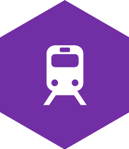

There are six kinds of data. Each is represented by a different colour tile.

<table>
<tr><th>Tiles<th>Data<th>Impact
<tr><td>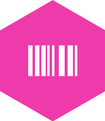 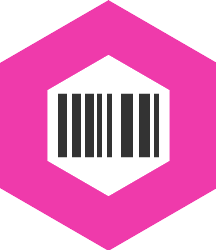<td>Product<td>Economic
<tr><td> 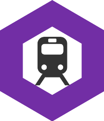<td>Transport<td>Economic
<tr><td>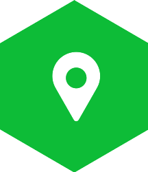 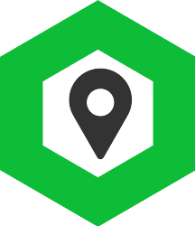<td>Geography<td>Environmental
<tr><td>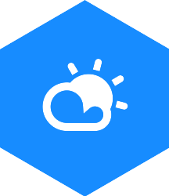 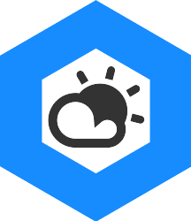<td>Weather<td>Environmental
<tr><td>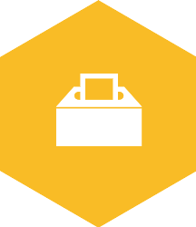 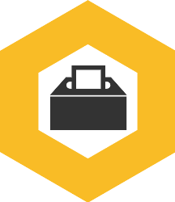<td>Democracy<td>Social
<tr><td>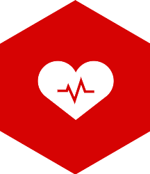 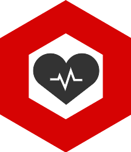<td>Health<td>Social
</table>

Each tile represents a dataset. For example, a Transport tile might represent data about bus timetables or the locations of rail stations.

Over the course of the game, you and others place tiles to create the **data infrastructure**. A data infrastructure looks like:

[data infrastructure]

Within the data infrastructure, individual datasets can be closed or open. **Closed data** looks like:

**Closed data** will have a counter on it indicating the player you **owns** the data. Only that player can legally use that data when building tools (but see Hacking, below).

**Open data** looks like:

Anyone can use **open data** when building tools.

Counters on the tiles indicate who is using the data in the **data infrastructure**.

## Tools

You can build tools by linking different kinds of data together. Each tool that you can build is represented by a card. For example:

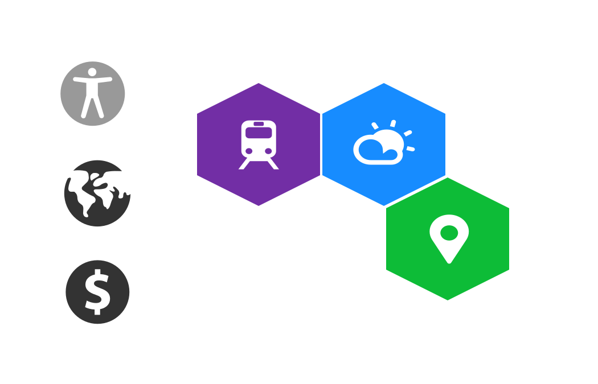

This tool uses transport, weather and location data. Perhaps it is an application that helps people get home by an appropriate route depending on the weather: if it's sunny, it recommends they walk or cycle; if it's raining, it will help them get a taxi.

During your turn, you can build new tools by matching the data shown on the card to the data that's available in the **data infrastructure**. The data in the **data infrastructure** must have exactly the same configuration as the picture on the card.

## The World

The world is in a state of flux. The **world board** shows how well the world is socially, environmentally and economically. 

<table width="100%">
<tr>
<th style="width: 33%; text-align: center">Social</th><th style="width: 33%; text-align: center">Environmental</th><th style="width: 33%; text-align: center">Economic</th>
</tr>
<tr><td style="text-align: center"></td><td style="text-align: center"></td><td style="text-align: center"></td></tr>
</table>

Each of these scores varies from 0 to 8. 8 represents utopia. 0 represents complete social, environmental or economic collapse. **If any score gets to 0 the game is over; everyone loses.**

Building tools helps the world. When you build a new tool, you may have a social, environmental or economic impact and increases one of the scores by one. You can choose which type of impact you have depending on the types of data that are used by the tool.

For example, if you build the tool:

you can choose to either have an economic or an environmental impact. These icons are highlighted on the card.

### Events

Each turn, something happens in the world. These are represented by **event cards**, which look like:

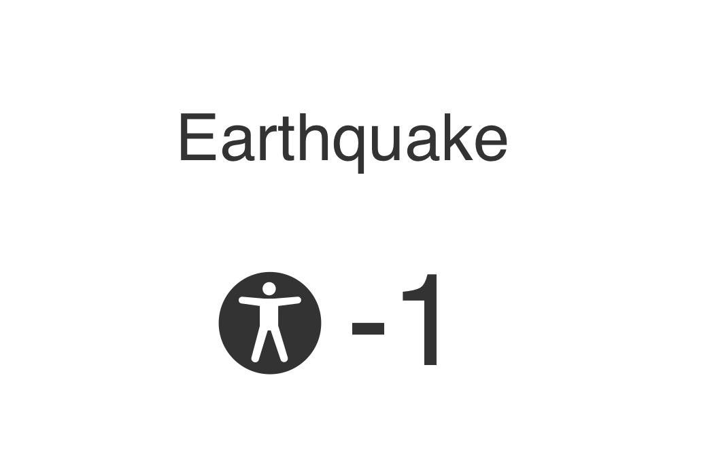

Events alter the world scores. They can add to a world score or (more frequently) reduce the score.

## Set Up

1. Set up the **world board**. Set each of the social, environmental and economic scores to 3.

2. Shuffle and place the **event cards** in a stack.

3. Place the **data tiles** in the bag.

4. Select a **data tile** at random from the bag and place it as **open data** in the centre of the table as the first piece of **data infrastructure**.

5. Each player should choose a colour token and place these **player tokens** beside them.

6. Each player should pick a **data tile** at random from the bag and place it next to the central **open data** as **closed data** within the **data infrastructure**, placing one of their tokens on their tile.

7. Shuffle the pack of **tool cards** and deal eight **tool cards** face down in front of each player. Place the remaining **tool cards** back in the box. Each player can take two **tool cards** into their hand.

## Turn Taking

Your hand consists of a number of **data tiles** and **tool cards**. When it is your turn:

1. Select a **data tile** at random from the bag to join your hand.

2. Play any **tool cards** that you want to play. You may play any number of **tool cards** during your turn; these remain face up in front of you to demonstrate your success. Play a **tool card** by:

   a. placing the **tool card** on the table so that it is visible to everyone
   
   b. placing **data tiles** from your hand as necessary, either as **closed data** or as **open data** to expand the **data infrastructure**
   
   c. placing your tokens on all the data tiles that are used to create the tool
   
   d. increasing a score on the **world board** based on the type(s) of **data tile** that you have used to build your tool
   
3. Take a new **tool card** from the pile in front of you.

4. Take a new **event card** from the pile and adjust the **world board** accordingly.

### Negotiation

At any time, you may open data that you own in the **data infrastructure** by flipping over the **data tile** to turn it from **closed data** to **open data**. (You cannot turn data from open data to closed data.)

At any time, you may negotiate with any other player. You can try to persuade other players to:

  * give you a **data tile**
  * give you a **tool card**
  * open data in the **data infrastructure**
  
You will usually have to do one of these things in exchange.

You can choose what to show other players of your hand. You may play with an open hand, so that everyone can see what you have and what you need. You may play with an open hand of tools but hide which data you have. You may show some tools but not others. It is up to you.

### Hacking

When you play a **tool card**, you may only legally use data to create your tool if that data is:

  * **open data**
  * **closed data** that you **own** (has your counter on it)

If there is some **closed data** that you want to use to build your tool and the player who **owns** that data is not paying attention, you may try to build the tool using that data. This is known as **hacking**.

If you manage to build a tool including placing your token on **closed data** owned by someone else, you have **hacked** that data and are then able to use it for further tools, or open it up, exactly as if you were the original owner.

The original owner may stop you from **hacking** their data at any point up to you adjusting the **world score** as a result of building the tool.

## Ending the Game

The game ends in three scenarios:

1. The **world score** on any impact measure reduces to zero. Everyone loses.

2. The **world score** on all three impact measures increases to eight. Everyone wins.

3. Any player uses all the **tool cards** from their hand, and there are no more **tool cards** in their pile. The player who has built the most tools wins.

## Example of Play

Ellen has the following cards in her hand:

The data infrastructure looks like this:

The world score looks like this:

She draws a blue data tile and realises that she can place it to build the first of the tools in her hand. However, doing this would not help the economy, which is in bad shape. If she rolls a 5 or 6 on the dice, it could be game over!

Ellen could place her second card, which would enable her to increase the economy score, if she could use James' yellow data. She asks him to open up that yellow data so that she can use it and offers the blue data that she has in exchange.

James takes the deal. He opens up his yellow data, leaving the data infrastructure like this:

Ellen plays the second of her tool cards. She places her tokens on the three datasets that she uses. The data infrastructure looks like:

Ellen choses to increase the economy score. The world score looks like:

Then Ellen rolls the dice. It's a 6! Ellen reduces the economy score again: it's a good thing she managed to play that application. If she hadn't, the game would be over.