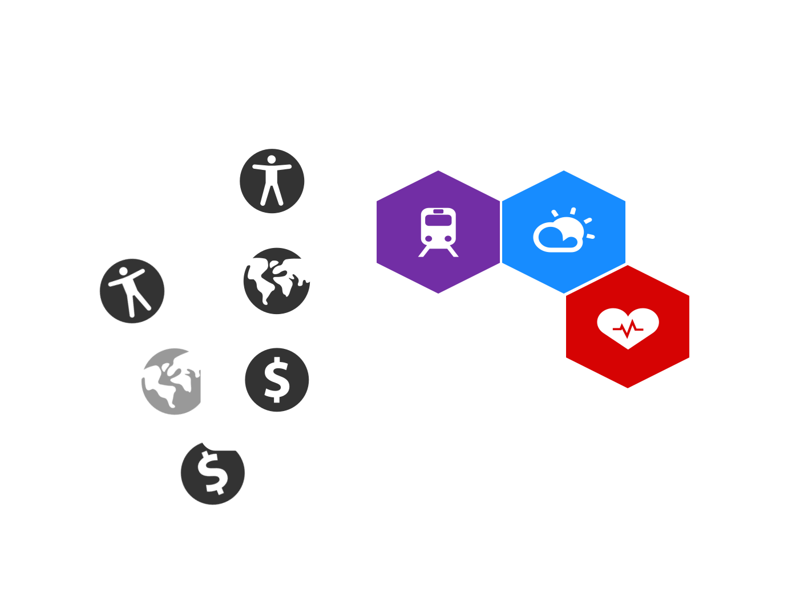

# Open Data Board Game Instructions

In this game, you and your fellow players run companies creating tools using data. You will work together to improve the health of the world you live in, and keep it from economic, social or environmental collapse. While you collaborate to maintain the health of your world, you have your own roles that can change the results of the game.

## Data

Data looks like this:

There are six kinds of data. Each is represented by a different colour tile.

<table>
<tr><th>Tiles<th>Data<th>Impact
<tr><td> <td>Product<td>Economic
<tr><td> <td>Transport<td>Economic
<tr><td> <td>Geography<td>Environmental
<tr><td> <td>Weather<td>Environmental
<tr><td> <td>Democracy<td>Social
<tr><td> <td>Health<td>Social
</table>

Each tile represents a dataset. For example, a Transport tile might represent data about bus timetables or the locations of rail stations.

Over the course of the game, you and others place tiles to create the **data infrastructure**. Your data infrastructure looks like:

[data infrastructure]

Within the data infrastructure, individual datasets can be closed or open. As the player placing data tiles, you can choose whether to place the tile as **open data** or **closed data**.

 **Closed data** looks like:

Only the player who has placed **closed data** can legally use that data to build apps. Players cannot build tools using other players' closed data.

**Open data** looks like:

Any player can use **open data** on the board to build tools.

Cones on the tiles indicate who is using the data in the **data infrastructure**. At the end of the game, the height of cones tells you which data is most used, and useful, in your data infrastructure.

## Winning the game

You win the game, and the game ends, if as a team all of the world scores - environmental, economic and social - get to 8.

You can also win individually - and end the game - if you are the first player to build tools adding up to 10 points. Each hexagon in a tool card is worth one point (so if you complete a tool with three hexagons, you receive three points).

At the end of the game, more than one player may be an individual winner. Each player has a role card with an individual winning condition.

## Laying tiles

During your turn, you may only lay tiles if you will use that(those) tiles complete one or more of your tool cards. You may lay as many tiles as you like in one turn if in doing so, you will complete tools.

You can make data tiles that you own open at any point during your turn. You cannot turn open data back into closed data.

Some data tiles have a black spot on them. These data tiles contain **private** or **personal** data and can never be opened.

## Tools

You can build tools by linking different kinds of data together. Each tool that you can build is represented by a card. For example:

This tool uses transport, weather and location data. Perhaps it is an application that helps people get home by an appropriate route depending on the weather: if it's sunny, it recommends they walk or cycle; if it's raining, it will help them get a taxi.

During your turn, you can build new tools by matching the data shown on the card to the data that's available in the **data infrastructure**. The data in the **data infrastructure** must have exactly the same configuration as the picture on the card. When building a new tool, you should describe for other players what it is you're building. For example, your tool using transport, weather and location data might be a 'wearable allowing you to dodge raindrops on your journey home.'

## The World

The world is in a state of flux. The **world board** shows how healthy the world is socially, environmentally and economically.

<table width="100%">
<tr>
<th style="width: 33%; text-align: center">Social</th><th style="width: 33%; text-align: center">Environmental</th><th style="width: 33%; text-align: center">Economic</th>
</tr>
<tr><td style="text-align: center"></td><td style="text-align: center"></td><td style="text-align: center"></td></tr>
</table>

Each of these scores varies from 0 to 8. 8 represents utopia. 0 represents complete social, environmental or economic collapse. **If any score gets to 0 the game is over; everyone loses.**

Building tools can help the world. When you build a new tool, you may have a social, environmental or economic impact that increases one of the scores by one. You can choose which type of impact you have depending on the types of data that are used by the tool.

For example, if you build the tool:

you can choose to either have an economic or an environmental impact. These icons are highlighted on the card.

### Events

Each turn, something happens in the world. These are represented by **event cards**, which look like:

Event cards reduce the health of the world, and can change the rules of the game.

## Set Up

1. Set up the **world board**. Set each of the social, environmental and economic scores to 4.

2. Shuffle and place the **event cards** in a stack.

3. Place the **data tiles** in a bag or box.

5. Provide each player with a **role card**. This is your individual winning condition for the game. Do not show your role to any other player.

4. Select one **data tile** at random from the bag and place it as **open data** in the centre of the table. This will be the first piece of **data infrastructure**, around which you start the game.

5. Each player chooses a set of coloured tokens, called **cones**.  These **coness** are used to identify data you own within the **data infrastructure**, and which data you are using - **open data** and **closed data** - to build your tools. By the end of the game, the cones will enable you to see which data sets are most useful in the data infrastructure.

6. Each player picks two **data tiles** at random from the bag and places one within the **data infrastructure** connected to the central **open data** tile. This first **data tile** must be placed as **closed data** within the **data infrastructure**. In this phase, you may lay your tile touching another player's closed data. At no other point in the game can you do this. Add a **cone** on top of your **closed data**, to signify that you own the data.

7. Shuffle the pack of **tool cards** and deal three **tool cards** to each player. Place the remaining **tool cards** on the table. Players may choose to display their **tool cards** face up on the table for other players to see, or hold them in their hand.

## Turn Taking

Your hand consists of a number of **data tiles** and **tool cards**. When it is your turn:

1. Select a **data tile** at random from the bag to join your hand.

2. Play any **tool cards** that you want to play. You may play any number of **tool cards** during your turn; these remain face up in front of you to demonstrate your success. Keep a tally of the points you are accumulating with each tool you complete. Play a **tool card** by:

   a. placing the **tool card** on the table so that it is visible to everyone

   b. placing **data tiles** from your hand needed to complete the app, either as **closed data** or as **open data** to expand the **data infrastructure**

   c. placing your cones on all the data tiles that are used to create the app

   d. increasing a score on the **world board** based on the tool you have built.

3. Decide whether you would like to discard any tool cards in your hand, in exchange for a new one.

4. If you have completed a tool, take a new **tool card** from the deck. You should always have three **tool cards** in your hand.

5. Take a new **event card** from the communal pile, follow its' instructions and adjust the **world board** accordingly.

### Negotiation

During your turn, you may open data that you own in the **data infrastructure** by flipping over the **data tile** to turn it from **closed data** to **open data**. (You cannot turn data from open data to closed data.)

During your turn, you may negotiate with any other player. You can try to persuade other players to:

  * give you a **data tile** (either outright or in exchange for data tiles)
  * give you a **tool card** (either outright or in exchange for data tiles)
  * agree to certain conditions that might improve your chances of completing your individual winning condition (role card)

You can also negotiate with other players to open up data that they own.

Players cannot negotiate with each other unless it is their turn.

You can choose what to show other players of your hand. You may play with an open hand, so that everyone can see what you have and what you need. You may play with an open hand of tools but hide which data you have. You may show some tools but not others. It is up to you.

## Ending the Game

The game ends in three scenarios:

1. The **world score** on any impact measure reduces to zero. Everyone loses.

2. The **world score** on all three impact measures increases to eight. Everyone wins.

3. Any player reaches 10 points based on the number of **tool cards** they have completed.

## If the world score gets to zero

If the world score gets to zero on any impact measure, players have **one chance** to recover from collapse. Despite the world score being zero, the next player can take their turn as usual. All players should work with that player to try to complete a tool and rebuild the health of the world. For this one **recovery play** the health of that impact measure can be increased to three, if a tool is successfully built.

## Example of Play

Ellen has the following cards in her hand:

The data infrastructure looks like this:

The world score looks like this:

She draws a blue data tile and realises that she can place it to build the first of the tools in her hand. However, doing this would not help the economy, which is in bad shape. If she picks up an event card that causes damage to the economy, the game could be over!

Ellen could place her second card, which would enable her to increase the economy score, if she could use James' yellow data that he has in his hand. She asks James for his yellow data, and offers the blue data that she has in exchange.

James takes the deal, but with one condition: that she lays that yellow data as open data. Ellen agrees. James provides the yellow data, Ellen lays it as open data, leaving the data infrastructure like this:

Ellen plays the second of her tool cards. She places her tokens on the three datasets that she uses. The data infrastructure looks like:

Ellen choses to increase the economy score. The world score looks like:

Ellen picks up an event card: argh! The economy takes a hit! Ellen reduces the economy score again: it's a good thing she managed to play that application. If she hadn't, the game would be over.
